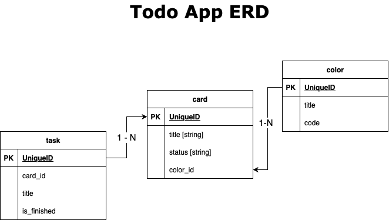

# Todo App Publisher

## Getting started

Todo App is an study case project to make a list for doing something, the purpose i created this project is for study typescript.

todo-app study project with tools:

- Express.js  - typescript
- Sequelize.js - typescript
- PostgreSQL

## System Flow

**ERD design for Todo App**

## **RESTful API Specification**

##### # Retrive Card API

**Metadata:**

| Element      |                      |
| ------------ | -------------------- |
| Method       | GET                  |
| Endpoint     | /v1/{:card_id}/cards |
| Content-Type | application/json     |

**Response:**

| Element | Sub Elemen | Data Type | Example          |
| ------- | ---------- | --------- | ---------------- |
| status  |            | boolean   | true             |
| message |            | string    | sukses           |
| data    |            | Object    |                  |
|         | card_id    | Integer   | 1                |
|         | color_id   | Integer   | 1                |
|         | title      | String    | Study Typescript |
|         | status     | String    | todo             |

##### # Retrive All Card API

**Metadata:**

| Element      |                  |
| ------------ | ---------------- |
| Method       | GET              |
| Endpoint     | /v1/cards        |
| Content-Type | application/json |

**Response:**

| Element | Sub Elemen | Data Type    | Example          |
| ------- | ---------- | ------------ | ---------------- |
| status  |            | boolean      | true             |
| message |            | string       | sukses           |
| data    |            | Array Object |                  |
|         | card_id    | Integer      | 1                |
|         | color_id   | Integer      | 1                |
|         | title      | String       | Study Typescript |
|         | status     | String       | todo             |

##### # Create Card API

**Metadata:**

| Element      |                  |
| ------------ | ---------------- |
| Method       | POST             |
| Endpoint     | /v1/card         |
| Content-Type | application/json |
| Body Request | form-data        |

**Request:**

| Element  | Data Type | Example       |
| -------- | --------- | ------------- |
| color_id | Integer   | 2             |
| title    | String    | Study Node.js |
| status   | String    | todo          |

**Response:**

| Element | Data Type | Example |
| ------- | --------- | ------- |
| status  | boolean   | true    |
| message | string    | sukses  |

##### # Update Card API

**Metadata:**

| Element      |                     |
| ------------ | ------------------- |
| Method       | PUT                 |
| Endpoint     | /v1/{:card_id}/card |
| Content-Type | application/json    |
| Body Request | form-data           |

**Request:**

| Element  | Data Type | Example       |
| -------- | --------- | ------------- |
| color_id | Integer   | 2             |
| title    | String    | Study Node.js |
| status   | String    | todo          |

**Response:**

| Element | Data Type | Example |
| ------- | --------- | ------- |
| status  | boolean   | true    |
| message | string    | sukses  |

##### # Delete Card API

**Metadata:**

| Element      |                     |
| ------------ | ------------------- |
| Method       | DELETE              |
| Endpoint     | /v1/{:card_id}/card |
| Content-Type | application/json    |
| Body Request | form-data           |

**Response:**

| Element | Data Type | Example |
| ------- | --------- | ------- |
| status  | boolean   | true    |
| message | string    | sukses  |

---

##### # Retrive Task API

**Metadata:**

| Element      |                     |
| ------------ | ------------------- |
| Method       | GET                 |
| Endpoint     | /v1/{:task_id}/task |
| Content-Type | application/json    |
| Body Request | form-data           |

**Response:**

| Element | Sub Elemen  | Data Type | Example          |
| ------- | ----------- | --------- | ---------------- |
| status  |             | boolean   | true             |
| message |             | string    | sukses           |
| data    |             | Object    |                  |
|         | task_id     | Integer   | 1                |
|         | card_id     | Integer   | 1                |
|         | title       | String    | Study Typescript |
|         | is_finished | Boolean   | false            |

##### # Retrive All Task API

**Metadata:**

| Element      |                  |
| ------------ | ---------------- |
| Method       | GET              |
| Endpoint     | /v1/task         |
| Content-Type | application/json |
| Body Request | form-data        |

**Response:**

| Element | Sub Elemen  | Data Type    | Example          |
| ------- | ----------- | ------------ | ---------------- |
| status  |             | boolean      | true             |
| message |             | string       | sukses           |
| data    |             | Array Object |                  |
|         | task_id     | Integer      | 1                |
|         | card_id     | Integer      | 1                |
|         | title       | String       | Study Typescript |
|         | is_finished | Boolean      | false            |

##### # Update Task API

**Metadata:**

| Element      |                     |
| ------------ | ------------------- |
| Method       | PUT                 |
| Endpoint     | /v1/{:task_id}/task |
| Content-Type | application/json    |
| Body Request | form-data           |

**Request:**

| Element     | Data Type | Example                  |
| ----------- | --------- | ------------------------ |
| card_id     | Integer   | 2                        |
| title       | String    | Study Advance Typescript |
| is_finished | Boolean   | false                    |

**Response:**

| Element | Data Type | Example |
| ------- | --------- | ------- |
| status  | boolean   | true    |
| message | string    | sukses  |

##### # Delete Task API

**Metadata:**

| Element      |                     |
| ------------ | ------------------- |
| Method       | DELETE              |
| Endpoint     | /v1/{:task_id}/task |
| Content-Type | application/json    |
| Body Request | form-data           |

**Response:**

| Element | Data Type | Example |
| ------- | --------- | ------- |
| status  | boolean   | true    |
| message | string    | sukses  |

---

##### # Retrive Color API

**Metadata:**

| Element      |                       |
| ------------ | --------------------- |
| Method       | GET                   |
| Endpoint     | /v1/{:color_id}/color |
| Content-Type | application/json      |
| Body Request | form-data             |

**Response:**

| Element | Sub Elemen | Data Type | Example |
| ------- | ---------- | --------- | ------- |
| status  |            | boolean   | true    |
| message |            | string    | sukses  |
| data    |            | Object    |         |
|         | color_id   | Integer   | 1       |
|         | title      | String    | Red     |
|         | hex_code   | String    | #81233  |

##### # Retrive All Color API

**Metadata:**

| Element      |                  |
| ------------ | ---------------- |
| Method       | GET              |
| Endpoint     | /v1/colors       |
| Content-Type | application/json |
| Body Request | form-data        |

**Response:**

| Element | Sub Elemen | Data Type    | Example |
| ------- | ---------- | ------------ | ------- |
| status  |            | boolean      | true    |
| message |            | string       | sukses  |
| data    |            | Array Object |         |
|         | color_id   | Integer      | 1       |
|         | title      | String       | Red     |
|         | hex_code   | String       | #81233  |

##### # Update Color API

**Metadata:**

| Element      |                       |
| ------------ | --------------------- |
| Method       | PUT                   |
| Endpoint     | /v1/{:color_id}/color |
| Content-Type | application/json      |
| Body Request | form-data             |

**Request:**

| Element  | Data Type | Example |
| -------- | --------- | ------- |
| title    | String    | White   |
| hex_code | String    | #FFFFF  |

**Response:**

| Element | Data Type | Example |
| ------- | --------- | ------- |
| status  | boolean   | true    |
| message | string    | sukses  |

##### # Delete Color API

**Metadata:**

| Element      |                       |
| ------------ | --------------------- |
| Method       | DELETE                |
| Endpoint     | /v1/{:color_id}/color |
| Content-Type | application/json      |
| Body Request | form-data             |

**Response:**

| Element | Data Type | Example |
| ------- | --------- | ------- |
| status  | boolean   | true    |
| message | string    | sukses  |

## Authors and acknowledgment

Created By Hafis Iqbal Sahrunizar.

## License

Private Source Project Only For Study Case
